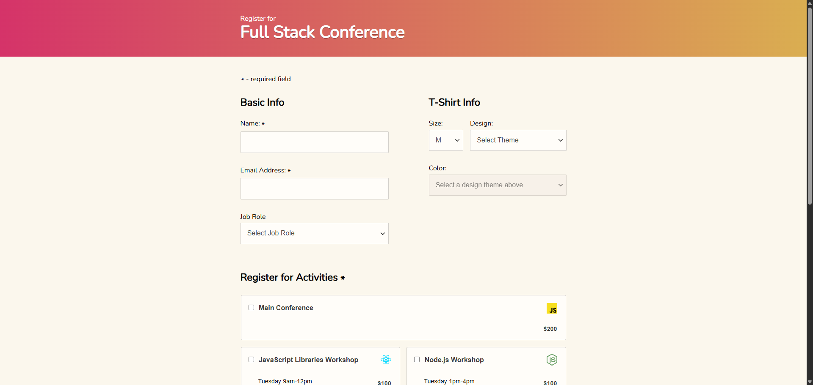

📝 Interactive Form Validation

Treehouse Full Stack JavaScript Techdegree – Unit 03

This project focuses on building an accessible and interactive registration form using vanilla JavaScript.
It covers real-world form behaviors such as conditional fields, dynamic UI updates, custom validation, and clear visual feedback without relying on built-in HTML5 validation.

🔗 Live : (https://fullstackmachina.github.io/unit_03_interactive_form/)

📸 Preview image

🎯 Project Requirements

- Automatically focus the Name field on page load
- Show/hide the “Other job role” input based on user selection
- Disable the T-Shirt color menu until a design is selected
- Dynamically filter available colors based on the selected design
- Calculate and update the total cost of selected activities
- Display only the selected payment method section
- Implement custom form validation (no HTML5 validation):
- Name field cannot be empty
- Email must be correctly formatted
- At least one activity must be selected
- Credit card fields are validated only if Credit Card is selected
- Prevent form submission if any required field is invalid
- Display clear visual error messages using custom styles
- Add visible focus states for activity checkboxes to improve accessibility

⭐ Extra Credit Features

Not implemented for this project.
Extra credit features were intentionally skipped in order to continue progressing through the Techdegree program and will be revisited later as personal improvements.

🧪 Testing & Quality Assurance

Tested form submission with:

- Empty form
- Partially completed form
- Fully valid form
Verified conditional behaviors:
 - Job role “Other” field visibility
 - T-Shirt color availability based on design
 - Payment method section toggling

Tested validation feedback for:
- Invalid name and email formats
- Missing activities
- Invalid credit card, ZIP, and CVV values
- Ensured all validation errors appear at once when submitting an empty form
- Monitored Chrome DevTools console for errors
- Ensured consistent indentation and readable code structure

🧠 What I Learned in this Unit

- Managing complex form logic with vanilla JavaScript
- Creating reusable validation helper functions
- Handling conditional UI states based on user input
- Working with data-* attributes to drive dynamic behavior
- Improving accessibility with focus and visual feedback
- Structuring JavaScript for clarity and maintainability

🛠️ Tech Stack

- JavaScript (ES6)
- HTML5
- CSS3

🔮 Possible Improvements

- Prevent selection of activities with conflicting schedules
- Add real-time validation feedback while typing
- Display conditional error messages based on error type
- Improve accessibility with ARIA attributes
- Add subtle animations for validation feedback
- Refactor validation logic into a more generic utility system